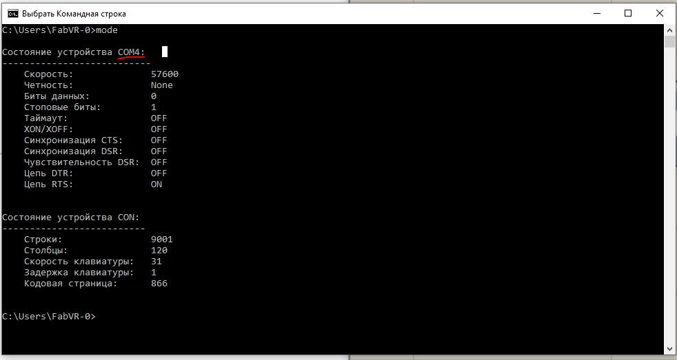
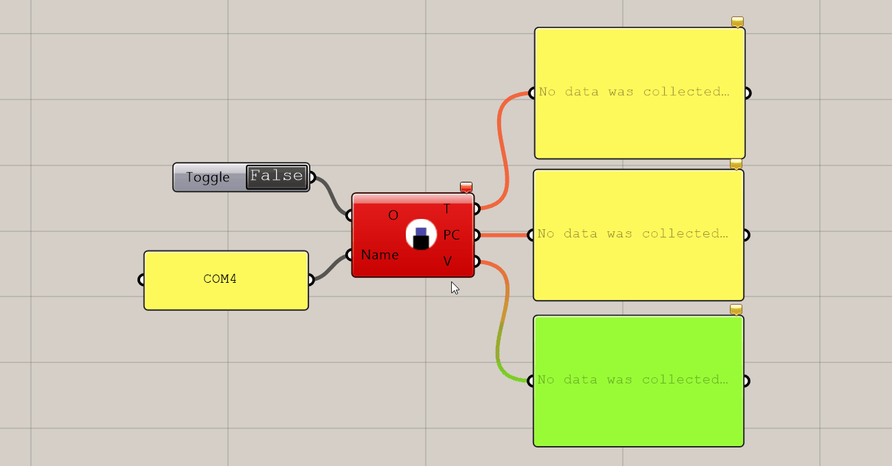

# fab-serial
Rhino Grasshopper Plugin for raw Serial data reading

**Tested with Rhino:**
- Version 6 (6.1.18023.13161, 01/23/2018) 
- Version 7 SR10 (7.10.21256.17001, 2021-09-13)

**Specs:**
- Delay is 20ms.
- Default baudrate is 9600.

**3 types of output are aviable:**
- single integer value (probably last),
- raw text,
- list (separate int numbers using ':' ).

**How to use it:**

0. Upload sketch from fab_serial.ino to your Arduino board.
1. List Serial ports using СMD in Windows: 
   
    

1. Copy FabSerial.gha to Grasshopper Folders -> Libraries and unlock file.
2. Restart Rhino and Grassshopper.
3. Now FabSerial component should be availabla at "Fab" tab in Grasshopper windows.
4. Plug in Toggle button component to "O" input of the FabSerial component.  
5. Plug in Panel component to set Serial port name (Arduino board is connected to) to "Name: input of the component:
6.  Toggle "True":
   
    
